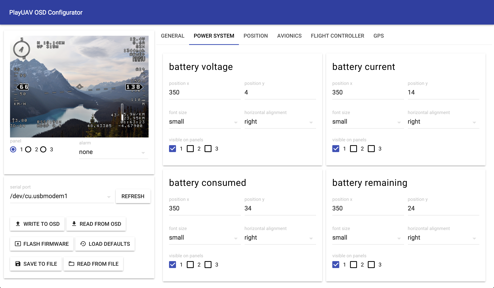

# Playuav OSD Configurator

A simple cross platform tool the playuav osd.

## What does it look like?

## Downloads

Can be found under [releases](https://github.com/TobiasBales/PlayuavOSDConfigurator/releases)

## Features

#### Config
The part to configure the osd
* change settings
* flash firmware
* write/read settings to osd
* write/read settings to file
* reset settings to default
* load settings from default.conf on startup (located in same directory as executable)

#### Pixler
Helper to make new icons/characters
* Create glyphs for small/medium/large fonts
* mirror image
* invert mask (black/white handling)
* move pixels around in frame

## Local setup

### Installing node
The prefered way is using [ndenv](https://github.com/riywo/ndenv) and running node `5.9.0`

### Building

    npm install
    npm run package

### Development server
    npm run hot-server
    npm run start-hot

### Commit messages, ci, linting etc
- Commit messages should follow the [angular commit message format](https://gist.github.com/stephenparish/9941e89d80e2bc58a153#format-of-the-commit-message)
- Pull requests will be automatically built on circle ci
- Run eslint against your changes (npm run lint)

## Warning
This software comes with no guarantees, it has worked great for me so far but if you blow something up or brick your board, I might be willing to help you but no guarantees.

## Special thanks
Special thanks go to the people who made/make the osd software/hardware and also the amazing people who made the electron-react-boilerplate which made the start of this project so much easier!
